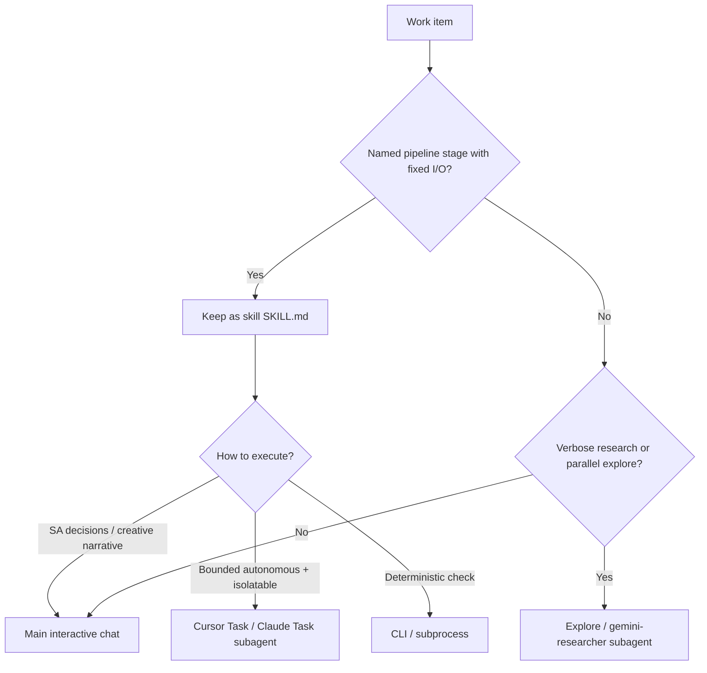

# loom — Agent patterns (skills vs subagents vs CLI)

How to choose **execution mode** for pipeline work without forking portable skills.

**Related:** [`docs/efficiency.md`](efficiency.md) (tokens, parallelism), [`docs/runtimes/cursor.md`](runtimes/cursor.md) (session boundaries, model table), [`.cursor/agents/`](../.cursor/agents/) (thin Cursor wrappers).

**Upstream (hive-mind):** model tiering and research offload live under `{hive-mind-root}/skills/hive-token-optimization/` (especially `references/GROUP_A_LOCAL_OPTIMIZATIONS.md` — Explore + Haiku for search; `gemini-researcher` for GCP research offload). Resolve `{hive-mind-root}` via `$HIVE_MIND_PATH` or `../hive-mind` ([`docs/ext-registry.yaml`](ext-registry.yaml)). Loom owns pipeline Tier A–E routing; hive-mind owns generic token/subagent tactics. User-level agents (e.g. `~/.claude/agents/gemini-researcher.md` when installed for Claude Code) complement project wrappers under `.cursor/agents/`.

---

## Framing

**Do not convert skills into subagents.** Loom skills are portable procedure docs (`skills/*/SKILL.md`) shared across Cursor, Claude, and Gem. Subagents are a **runtime execution mode**: an isolated worker that still **reads the skill**, writes engagement artifacts under `$LOOM_ENGAGEMENTS_ROOT/{slug}/`, and returns a short summary to the parent.

Isolation today also comes from:

- **Fresh chat per stage** — preferred default for sequential creative work ([`docs/runtimes/cursor.md`](runtimes/cursor.md))
- **Parallel Task/subagent pairs** — wall-clock win when stages are independent ([`docs/efficiency.md`](efficiency.md) §4)
- **CLIs** — zero-AI inventory and health checks

---

## Decision criteria

| Prefer **skill + main chat** | Prefer **skill + subagent** | Prefer **CLI (not AI)** |
|------------------------------|-----------------------------|-------------------------|
| SA approval gates (D-024, ideation freeze) | Bounded inputs/outputs from files | Inventory, health, dry-run |
| Consultative / creative judgment | Context pollution risk (ZIP parse, cluster probe dumps) | Zero ambiguity scripts |
| Cross-stage orchestration and blocker handling | Independent of sibling work (true parallelism) | Already exists (`inventory.py`, `wind_pulse.py`) |
| Must preserve portable skill across runtimes | Fast-model tier extraction / checklist work | |

### Task vs fresh chat vs CLI

| Mode | When |
|------|------|
| **Fresh chat** | Default for Tier C stages and any sequential stage the SA wants focused; one stage = one session |
| **Subagent (Task)** | Inside a long orchestrator session; Tier A stages; true parallel pairs; noisy probe/parse work that would pollute the parent context |
| **CLI** | Status, health, dry-run before opening any AI session |

---

## Tier A — Strong subagent execution (keep skill; run isolated)

| Capability | Why subagent | Notes |
|------------|--------------|-------|
| **warp-listen** | Structured extraction; 3 fixed artifacts; low SA dialogue | Parallel with warp-scan |
| **warp-scan** | Large diagnostic ZIP → structured JSON; noisy intermediate context | Same parallel pair |
| **thread-audit** | Matrix/lookup against known rules; fast-model tier | Needs discovery + profile files only |
| **finish-check** | Template checklist from prior artifacts | Deterministic aggregation |
| **finish-verify** (“Agent A”) | Cluster probes + multi-skill dispatch → `asset-bundle/`; verbose API output | Natural isolation boundary before bootstrap |
| **bolt-bootstrap** (+ **bolt-ech** / **bolt-serverless**) (“Agent B”) | Translate verified bundle → Terraform/Python codegen | File-in / file-out; live apply still gated in parent |
| **wind-pulse** (internal probes) | Independent cluster checks | Prefer **CLI first**; AI only to interpret failures |
| **weave-train** | Post–data-model ML JSON codegen; little chat needed | Parallel with weave-fleet |
| **weave-fleet** | Package catalog + manifest after data model | Parallel with weave-train |

---

## Tier B — Hybrid (skill stays interactive; spawn subagents *inside*)

| Capability | Main thread keeps | Delegate to subagent |
|------------|-------------------|----------------------|
| **loom** orchestrator | Inventory, gates, approvals, stage ordering | Spawn Tier A stages as Task workers; merge via `{slug}-pipeline-state.json` |
| **finish-verify** | Schema gate go/no-go, halt decisions | Parallel Explore workers for package asset inventory, ES\|QL validation, hive-mind pattern lookup |
| **weave-model** | Overall mapping design decisions | Schema probes / EPR package reads as Explore subagents |
| **weave-query** | Vulcan contract ownership | Vulcan/CLI subprocesses already act as lightweight workers |
| **thread-suggest** | Borderline SA choice | Catalog match against `standard-demos.md` can be a fast subagent; decision stays in main |
| **warp-scout** / **warp-discovery** | AE/SDR conversation + slug confirm | Internally spawn listen/scan/qualify as subagents |

---

## Tier C — Keep as skill in main interactive chat (poor subagent fit)

| Capability | Why not a subagent |
|------------|--------------------|
| **warp-spark** | Consultative coaching, freeze contract, approval gate |
| **thread-qualify** | MEDDPIC judgment; can stop the pipeline |
| **weave-script** | Creative narrative; needs SA voice/key-asks clarification |
| **bolt-spin** | Spend / region / deployment-type approval (D-024) |
| **wind-reset** | Destructive confirm on shared clusters |
| **loom** itself | Must own approvals and “proceed anyway” |

---

## Tier D — Stay skills, not subagents (thin / backlog / deprecated)

| Capability | Reason |
|------------|--------|
| **bolt-launch** | Deprecated stub → finish-verify + bolt-bootstrap |
| **weave-pipe**, **wind-streams**, **bolt-eck** | Spec-only backlog |
| **weave-agent**, **weave-cost** | Skills stay; sequential after script (agent) or additive to model (cost). Do **not** parallel weave-agent with weave-train — agent is Stage 4b (post-script); train is Stage 6 (post-model) |

---

## Tier E — Prefer CLI over AI subagent

| Tool | Role |
|------|------|
| `scripts/inventory.py` | Stage status without a chat |
| `skills/wind-pulse/wind_pulse.py` | Pre-demo health |
| `bootstrap.py --dry-run` / `teardown.py --dry-run` | Safe validation |

---

## Parallelization map

| Parallel pair | Condition |
|---------------|-----------|
| warp-listen ∥ warp-scan | Both inputs present |
| weave-fleet ∥ weave-train | Both need completed data model (Stages 5.5 + 6) |
| wind-pulse probe sections | Independent health checks |

Optional same-session fan-out inside finish-verify: package probes ∥ index-template probes ∥ managed-asset inventory.

---

## What *not* to do

- Do not fork `SKILL.md` into Cursor-only procedure bodies (breaks Claude/Gem portability). Thin `.cursor/agents/*.md` wrappers may **point at** skills only.
- Do not replace session-per-stage guidance with “always spawn subagents” — subagents help **within** a long orchestrator session or for **parallel** pairs; fresh chats remain the cost/accuracy default for sequential creative stages.
- Do not put D-024 / ideation / qualification decisions inside unattended subagents.
- Do not convert elastic/agent-skills dispatch inside finish-verify into permanent Cursor subagent types (skill dispatch per D-007).

---

## Cursor wrappers

Project subagents under [`.cursor/agents/`](../.cursor/agents/) are thin prompts: read the named `skills/<name>/SKILL.md`, run that stage, write artifacts, return a short summary. Skills remain the source of truth.

For ad-hoc research/explore (not a loom stage), prefer hive-mind token guidance and Cursor/Claude built-in Explore (or a user-installed `gemini-researcher` under `~/.claude/agents/` when using Claude Code) rather than adding another project wrapper.
